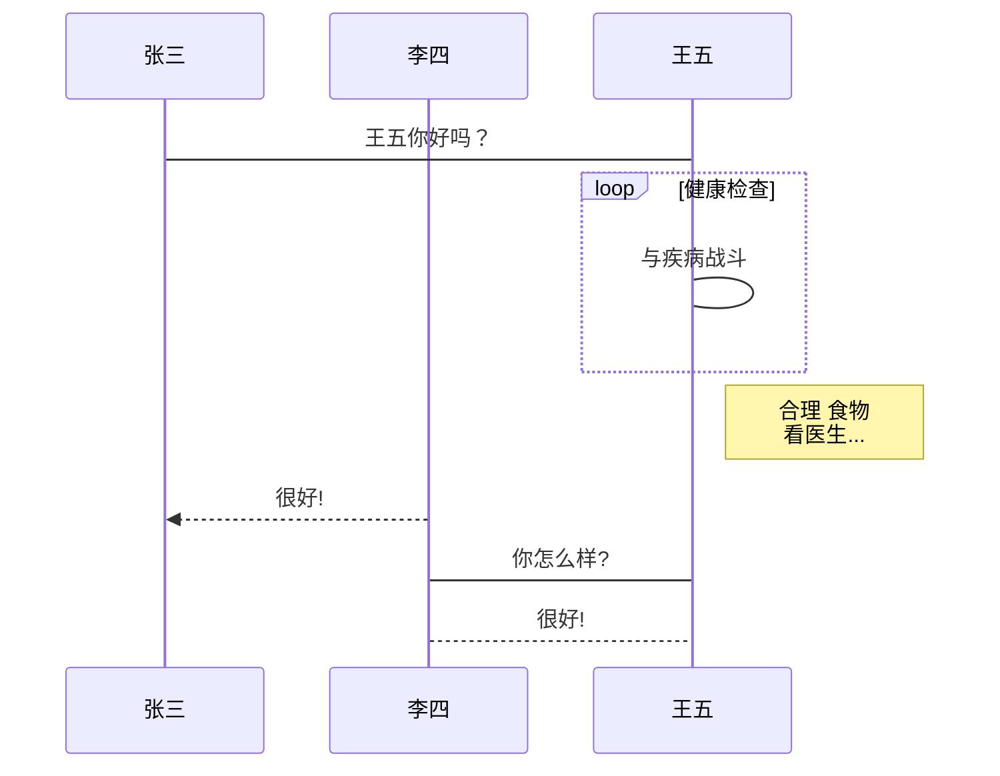

****空行-回车/两个空格  表示
"换行"


[markdown语法][mdLink]
> 代码段:`printf()` 
> 可以用 ``` 包裹一段代码，并指定一种语言（也可以不指定）：
```javascript
$(document).ready(function () {
    alert('RUNOOB');
});
```

[高级链接](https://www.runoob.com/markdown/md-link.html) or <https://www.runoob.com/markdown/md-link.html>

[ mdLink ]: https://www.runoob.com/markdown/md-link.html 

# 段落格式
##脚注
脚注是对文本的补充说明。

Markdown 脚注的格式如下:

[^要注明的文本]
以下实例演示了脚注的用法：

创建脚注格式类似这样 [^RUNOOB]。

[^RUNOOB]: 菜鸟教程 -- 学的不仅是技术，更是梦想！！！
演示效果如下：


# Markdown图片


# Markdown 表格
* -: 设置内容和标题栏居右对齐。
* :- 设置内容和标题栏居左对齐。
* :-: 设置内容和标题栏居中对齐。

> 例子

| 表头 | 表头 | 表头 |
| --- | --- | ---  |
| 单元格| 单元格|单元格|

| 左对齐 | 右对齐 | 居中对齐 |
| :--- | ---: | :-----: |
| 单元格| 单元格|单元格|

| 左对齐 | 右对齐 | 居中对齐 |
| :---- | ----: | :----: |
| 单元格 | 单元格 | 单元格 |
| 单元格 | 单元格 | 单元格 |

# Markdown 高级技巧
* 流程图、UML、甘特图、时序图(顺序图)
* 数学公式
* Html元素标签
* 1. \<kbd> 
* 2. \<hr>
* 3. .....
[eg:]


[ __md高级技巧__ ][advance]
=


>
> ####【方法】：
>>学习语言，就是为了使用，在不能动手敲的时候，去阅读代码！
>>>读！！！！


[ advance ]:https://www.runoob.com/markdown/md-advance.html
